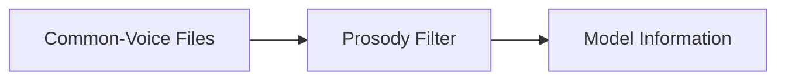
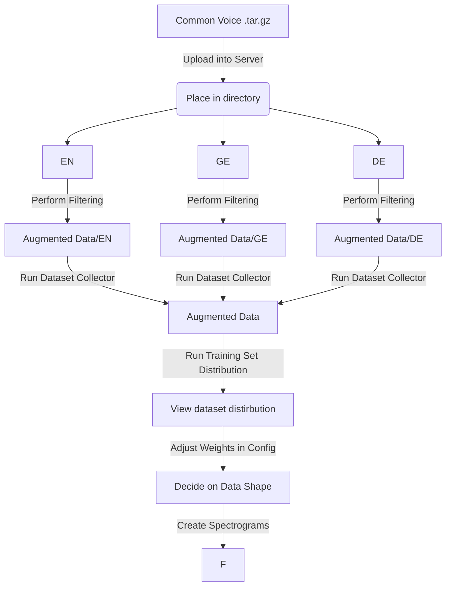

# This Notebook Discussess the Structure of Codebase

## Flow of files

### Common Voice Files
> This directory contains all languages downloaded from commonvoice with no modifications to them

### Prosody Filter
> This directory contains all the prosody filtered files, along with information on audio file length

#### Breakdown

.
├── en
│   ├── clips
│   ├── custom
│   │   └── lengths.csv
│   └── validated.tsv
├── it
└── ja

### Model Information
> This directory contains all information involved in generating a model
- Spectrograms by language
- Dataset distribution
- Models trained on spectrograms

#### Folder Breakdown
.
├── en
│   └── spect
       └── test
          ├── Batch00001.pt
          ├── ...
          └── Batchxxxx.py 
       └── train
          ├── Batch00001.pt
          ├── ...
          └── Batchxxxx.py 
       └── validate
          ├── Batch00001.pt
          ├── ...
          └── Batchxxxx.pt 
├── it
├── ja
├── models
    ├── Model-1
    ├── ...
    └── Model-n
└── statistics
    ├── dataset.pkl
    ├── lengths.pkl
    └── speakers.pkl

### Organization

## Flow of creating a model
